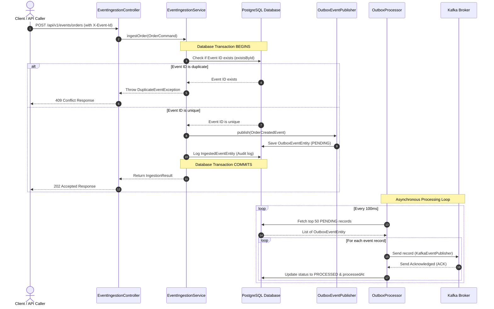
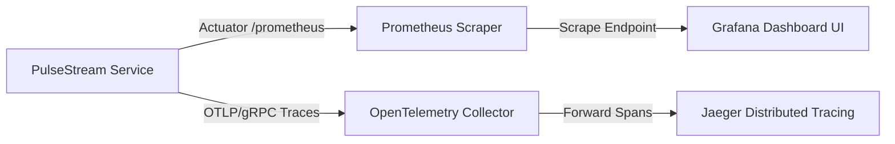

# PulseStream — Real-Time Event-Driven Business Analytics Platform

[](https://openjdk.org/projects/jdk/21/)
[](https://spring.io/projects/spring-boot)
[](https://kafka.apache.org/)
[](https://www.postgresql.org/)
[](LICENSE)

PulseStream is a production-grade, highly observable, event-driven business analytics platform engineered with **Java 21**, **Spring Boot 3**, **Apache Kafka**, and **PostgreSQL 16**.

Designed as a high-fidelity **engineering portfolio project**, PulseStream showcases advanced distributed systems reliability, **Hexagonal / Clean Architecture (Ports & Adapters)**, transactional event-driven consistency, **JWT authentication with Role-Based Access Control (RBAC)**, fault-tolerant **Dead Letter Queue (DLQ)** recovery pipelines, and complete **MDC correlation tracing** backed by **Prometheus** and **Grafana** metrics monitoring.

---

## 🏗️ System Blueprint & Distributed Topology

PulseStream implements a high-throughput **Command Query Responsibility Segregation (CQRS-Lite)** topology. Inbound write operations (commands) are processed asynchronously through a transactional outbox queue, while heavy aggregate analytics (queries) execute against index-hardened PostgreSQL tables protected by a Resilience4j fault tolerance layer.

### 1. High-Fidelity System Architecture

```mermaid
graph TD
    Client[REST API Client / k6 / JMeter] -->|HTTPS POST| IngestionGW[Event Ingestion Gateway<br/>EventIngestionController]
    Client -->|HTTPS GET| AnalyticsEngine[Analytics & Metrics Engine<br/>AnalyticsController]

    subgraph Spring Boot 3 Core Service [PulseStream Application]
        IngestionGW -->|Orchestrates Command| IngestionUseCase[IngestEventUseCase<br/>EventIngestionService]
        IngestionUseCase -->|Transactional Save| IngestedEventRepo[IngestedEventRepository]
        IngestionUseCase -->|Transactional Save| OutboxPublisher[EventPublisher<br/>OutboxEventPublisher]

        OutboxScheduler[OutboxProcessor<br/>@Scheduled Background Poll] -->|Fetch PENDING| OutboxRepo[SpringDataOutboxRepository]
        OutboxScheduler -->|Publish Event| KafkaPublisher[KafkaEventPublisher]

        AnalyticsEngine -->|Query Metrics| MetricsUseCase[MetricsQueryUseCase<br/>AnalyticsService]
        MetricsUseCase -->|Optimized Fetch| AnalyticsRepo[AnalyticsQueryRepository<br/>AnalyticsQueryPersistenceAdapter]
    end

    subgraph Relational Database [PostgreSQL 16]
        IngestedEventRepo -->|Deduplicate & Log| IngestedEventsTable[(ingested_events)]
        OutboxPublisher -->|Save Outbox Event| OutboxEventsTable[(outbox_events)]
        OutboxRepo -->|Read/Update Status| OutboxEventsTable
        AnalyticsRepo -->|Query Aggregates| OrdersTable[(orders)]
        AnalyticsRepo -->|Query Aggregates| PaymentsTable[(payments)]
        AnalyticsRepo -->|Query Aggregates| RefundsTable[(refunds)]
    end

    subgraph Event Broker [Kafka Broker]
        KafkaPublisher -->|At-Least-Once Send| KafkaTopics[[Kafka Event Topics<br/>order-created / payment-confirmed]]
    end
```

### 2. Hexagonal Clean Architecture Structural Rings

The system strictly enforces the dependency inversion rule: **Domain (Pure Core) ➔ Application (Use Cases) ➔ Infrastructure (Adapters)**.

```text
PulseStream Core (Hexagonal Rings)
┌────────────────────────────────────────────────────────┐
    Infrastructure Layer (Outer Ring)
    [JPA Entities] [Kafka Producer/Consumers] [Security]
    [Spring Boot Controllers] [Swagger UI / Actuator]
          │
          ▼
    ┌──────────────────────────────────────────────────┐
    │  Application Layer (Use Cases / Service Core)    │
    │  [IngestEventUseCase] [MetricsQueryUseCase]       │
    │  [EventPublisher Port] [AnalyticsQueryPort]       │
    │        │                                         │
    │        ▼                                         │
    │  ┌────────────────────────────────────────────┐  │
    │  │  Domain Layer (Pure Center Ring)           │  │
    │  │  [Order] [Payment] [Refund] [Activity]      │  │
    │  │  [DomainEvent] [Repository Ports]          │  │
    │  └────────────────────────────────────────────┘  │
    └──────────────────────────────────────────────────┘
└────────────────────────────────────────────────────────┘
```

- **Domain Core (Pure Center)**: Contains business entities, invariants, custom constraints, and interface definitions. Contains **zero external library dependencies** (no Spring, Hibernate, or Jackson annotations), ensuring portability and clean technical boundaries.
- **Application Orchestration (Middle Ring)**: Declares input/output ports (interfaces) and implements application use cases. Manages latency telemetry boundaries using Micrometer timer samplers.
- **Infrastructure Adapters (Outer Ring)**: Handles persistence mappers, Kafka record headers, JWT token parsing, and REST controllers.

---

## 🛡️ Reliability Engineering & Fault Tolerance

PulseStream goes beyond standard tutorial projects by implementing absolute **at-least-once** delivery guarantees, idempotent event ingestion, and resilient query circuit breakers.

### 1. Transactional Outbox Pattern

To prevent dual-write failures (where database persistence succeeds but Kafka broker publishing fails, or vice-versa), PulseStream isolates Kafka dispatches behind a **Transactional Outbox** mechanism.



- **ACID Transaction Guarantee**: When an operational endpoint is hit, deduplication, audit-logging, and outbox record insertion execute inside a single `@Transactional` boundary.
- **Background Dispatcher**: A thread-safe background `OutboxProcessor` continuously polls pending events from `outbox_events` table ordered by creation time, publishes them asynchronously to Kafka via a Resilience4j protected publisher, and transitions records to `PROCESSED`.
- **Fault Resilience**: If a broker failure occurs, the scheduler retries dispatching up to 5 times using exponential backoff wait durations. If still unsuccessful, the outbox record transitions to `FAILED` with logged error context for developer review, eliminating silent failures.

### 2. Idempotent Ingestion Deduplication

API clients can supply a unique transaction tracking identifier via the HTTP header `X-Event-Id`.
- **Double-Pass Deduplication**: The ingestion controller intercepts this value and calls the `IngestedEventRepository.existsById()` lookup. If it is already marked processed, the engine throws a `DuplicateEventException`, which is seamlessly caught by the `GlobalExceptionHandler` returning an HTTP `409 Conflict` response.
- **Deduplication Telemetry**: Failed duplicate ingestions increment a dedicated Micrometer metric `pulsestream.events.ingestion.failed.total` tagged with `failureType="DUPLICATE_EVENT"`.

### 3. Event Schema Evolution (Versioning)

To support robust long-term schema evolutions, domain events declare a version contract:
- **Default Version Interface**: The `DomainEvent` sealed interface specifies `default Integer schemaVersion() { return 1; }`.
- **Backward-Compatible Record Deserialization**: Record types (like `OrderCreatedEvent`) declare `Integer schemaVersion` as their final parameter. Using a compact record constructor `if (schemaVersion == null) { this.schemaVersion = 1; }`, older version-less JSON logs (e.g. from historical data files or replayed streams) deserialize flawlessly with default version `1`.

### 4. Resilience4j Circuit Breakers & Retries

PulseStream implements programmatic fault tolerance to avoid thread resource starvation:
- **Kafka Broker Retry**: `KafkaEventPublisher` is annotated with `@Retry(name = "kafkaPublish")`, configured to perform up to 3 attempts with exponential backoff on transient broker dropouts.
- **Database Analytics Protection**: The heavy-duty `AnalyticsQueryPersistenceAdapter` is protected by class-level `@CircuitBreaker(name = "databaseAnalytics")` and `@Retry(name = "databaseAnalytics")` annotations. If connection pool saturation or lockups occur, queries fail-fast, preventing thread leaks and cascading performance bottlenecks.

---

## ⚡ API Specifications & Functional Endpoints

All operational and analytical endpoints require Bearer JWT authentication.

### 🔑 1. JWT Authentication
- **Endpoint**: `POST /api/v1/auth/token`
- **Pre-Seeded Directory (Password: `password` for all)**:
  - `admin` (Role: `ROLE_ADMIN` — Permitted to ingest events and read metrics)
  - `analyst` (Role: `ROLE_ANALYST` — Permitted to query metrics (read-only))
  - `user` (Role: `ROLE_USER` — Restricted basic credentials)

### 📥 2. Real-Time Ingestion Gateway (Requires `ROLE_ADMIN`)
All ingestion endpoints return a `202 Accepted` immediately upon successfully committing the event to the transactional outbox queue.

- **POST `/api/v1/events/orders`** — Ingest customer order creation.
- **POST `/api/v1/events/payments`** — Ingest payment gateway confirmation logs.
- **POST `/api/v1/events/refunds`** — Ingest refund execution triggers.
- **POST `/api/v1/events/activity`** — Ingest client interaction activities.

*Optional Header*: `X-Event-Id` (UUID string) — Enforces idempotency.

### 📊 3. Analytical Engine (Requires `ROLE_ADMIN` or `ROLE_ANALYST`)
Retrieves analytical aggregates over a default 30-day sliding time window (customizable via `start` and `end` ISO-8601 query parameters).

- **GET `/api/v1/metrics/revenue`** — Sum of all completed order amounts.
- **GET `/api/v1/metrics/orders`** — Total order volume.
- **GET `/api/v1/metrics/refunds`** — Sum of approved refund values.
- **GET `/api/v1/metrics/top-products?limit=5`** — Ranked list of best-selling products.
- **GET `/api/v1/metrics/customer-activity`** — Distribution of customer activities by action type.
- **GET `/api/v1/metrics/events?page=0&size=10`** — **Paginated Event Log** query plan pulling historic event logs.

---

## 👁️ Distributed Observability & Telemetry

PulseStream features a production-grade observability topology using standard CNCF technologies:



### 1. Prometheus Scrape Configuration
Prometheus automatically scrapes the Spring Boot Actuator endpoint at `/actuator/prometheus` on a 5-second interval, capturing JVM performance, Kafka topic latency lag, and custom Micrometer timers.

### 2. MDC Correlation Tracing & OTEL Compatibility
When a request hits `EventIngestionController`, a unique correlation ID is extracted (via the HTTP `X-Correlation-Id` header) or dynamically generated. This correlation ID is injected into MDC (Mapped Diagnostic Context) logging across all execution threads, database transactions, the transactional outbox publisher scheduler, and outbound Kafka record headers. This enables cohesive trace correlation across raw console logs.

Additionally, the system infrastructure (defined in `docker-compose.yml`) is fully provisioned with an **OpenTelemetry Collector** and **Jaeger Tracing** collector pipeline. To enable zero-code gRPC span tracing of HTTP controllers, Hibernate JDBC query plans, and Kafka events at runtime, developers can simply attach the standard [OpenTelemetry Java Agent](https://opentelemetry.io/docs/zero-code/java/agent/) to the Spring Boot JVM startup parameters.

### 3. Auto-Provisioned Grafana Dashboard
Grafana is pre-configured with default datasource registries. It automatically loads our system health metrics dashboard (`PulseStream Distributed Performance Monitor`) displaying:
- Event Ingestion Throughput by event type.
- Ingestion SLA latencies (p95 and p99 percentile thresholds).
- Database persistence execution timings.
- Outbox processing latency percentiles.

---

## 🛠️ Local Development & Operational Setup

### Prerequisites
- **Java 21 / JDK 21**
- **Docker Desktop**
- **k6** (optional, for running load benchmark scripts)

### 🚀 1. Booting Infrastructure Services
To spin up PostgreSQL, Zookeeper, Kafka, Prometheus, Jaeger, and Grafana in the background:
```bash
docker compose up -d
```
Check health states:
- PostgreSQL is available at `localhost:5432`
- Prometheus is running at `localhost:9090`
- Jaeger Tracing is running at `localhost:16686`
- Grafana Dashboard UI is running at `localhost:3000`

### 🧪 2. Running Verification Pipelines
Execute the fail-fast validation script (verifies maven compile, static analysis warnings, and launches Testcontainers integration tests):
```bash
./scripts/verify.sh
```

### 📊 3. Benchmarking with k6 Load Tests
PulseStream includes realistic k6 stress testing scripts inside the `load-tests/` directory:
- Run the high-throughput ingestion stress benchmark:
  ```bash
  k6 run load-tests/ingestion-stress.js
  ```
- Run the concurrent analytics endpoints query stress benchmark:
  ```bash
  k6 run load-tests/analytics-stress.js
  ```

---

## ⚖️ Distributed Tradeoffs & Limitations

1. **Transactional Outbox Polling vs Change Data Capture (CDC)**: PulseStream uses a `@Scheduled` background worker polling the database `outbox_events` table. While highly cohesive and easy to run in a single container, a high polling rate creates read query overhead on PostgreSQL.
2. **Kafka Partition Level Ordering**: Since events are dispatched asynchronously via outbox scheduler polling, partition keys must align with aggregation IDs (`orderId`, etc.) to preserve transaction sequence integrity during high consumer workloads.
3. **Pessimistic vs Optimistic Locking on Metrics Aggregation**: Analytical aggregates execute real-time Hibernate query aggregates over temporal fields. In standard read-heavy environments, this pattern scales best when paired with Read-Replicas or materialized analytical views rather than transactional databases.

---

## 🚀 Scaling & Evolution Roadmap

- **Debezium CDC (Change Data Capture)**: Migrate the outbox scheduler to an asynchronous transaction log reader like Debezium, bypassing database select query overhead and streaming changes straight to Kafka.
- **Cache-Layer Analytics**: Introduce Redis caching to store analytics query outcomes (e.g. `sumRevenue` or `top-products`) with dynamic TTL invalidation triggered by incoming Kafka topic consumer updates.
- **Schema Registry Integration**: Replace raw JSON event payloads with strict Avro serialization schemas integrated into a Confluent Schema Registry.
