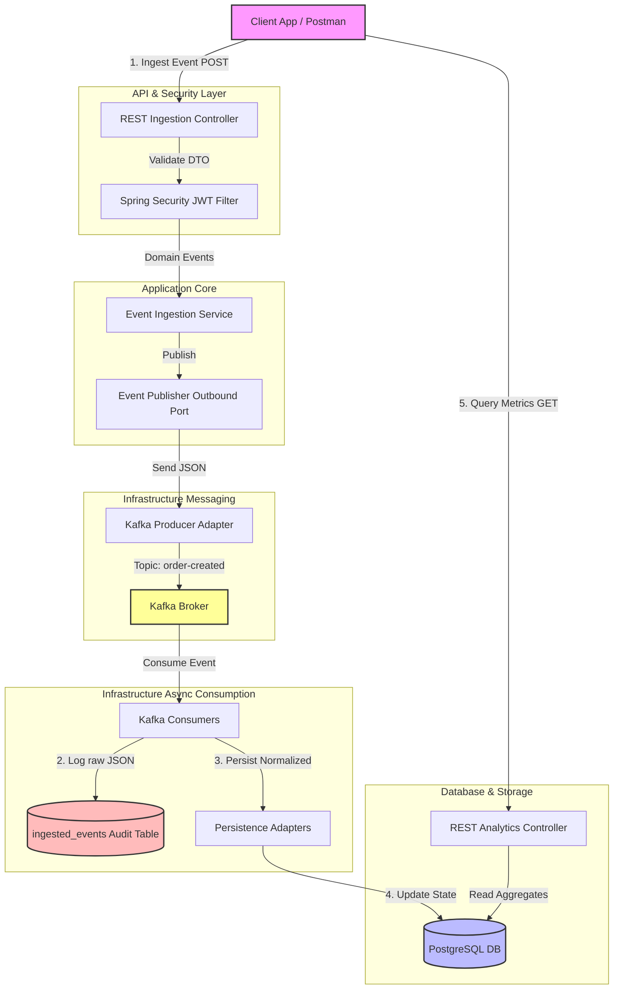

# PulseStream — Real-Time Event-Driven Business Analytics Platform

[](https://openjdk.org/projects/jdk/21/)
[](https://spring.io/projects/spring-boot)
[](https://kafka.apache.org/)
[](https://www.postgresql.org/)
[](https://www.docker.com/)
[](#cicd)

PulseStream is a production-grade, highly aesthetic event-driven business analytics platform. It ingests raw business transactions, streams them asynchronously through Kafka, persists normalized models in PostgreSQL, and serves highly optimized analytical metrics via secure APIs.

---

## 🏗️ Architecture Overview (Clean Architecture / DDD)

PulseStream implements a strict **Clean Architecture** combined with **Domain-Driven Design (DDD)** principles and a **CQRS (Command Query Responsibility Segregation) Lite** streaming loop. This separates transactional write throughput (Commands) from heavy analytical reads (Queries).



### 📂 Directory & Package Structure
```text
PulseStream/
├── .github/
│   └── workflows/
│       └── ci.yml               # Automated GitHub Actions Workflow
├── config/
│   ├── prometheus/
│   │   └── prometheus.yml       # Prometheus Metrics Scraper settings
│   └── grafana/
│       └── provisioning/        # Auto-provisioned Grafana templates
├── docker-compose.yml           # Postgres, Kafka, Prometheus & Grafana Bootstrapper
├── .env.example                 # Environment Configurations
├── .gitignore                   # Safe Git Ignored Artifacts
├── pom.xml                      # Maven Configuration
└── src/
    ├── main/
    │   ├── java/com/pulsestream/
    │   │   ├── PulseStreamApplication.java
    │   │   ├── api/             # REST Controllers, Exception mapping & DTO Records
    │   │   ├── application/     # Inbound/Outbound Ports, Use Cases & Services
    │   │   ├── domain/          # Pure Domain Entities, Events & Repository interfaces
    │   │   ├── infrastructure/  # JPA Entities, Kafka Producers/Consumers & Flyway DB
    │   │   ├── config/          # Kafka Topic & OpenAPI/Swagger configurations
    │   │   ├── security/        # Spring Security Filters, UserDetailsService & JWT provider
    │   │   └── observability/   # CorrelationId filters, structured logs & Micrometer
    │   └── resources/
    │       ├── db/migration/    # Flyway Migrations (Schema & User seeding)
    │       ├── application.yml  # Externalised App Configurations
    │       └── logback-spring.xml # Request-Correlated Console Logging Layout
    └── test/                    # JUnit 5 & Testcontainers Integration Test Suite
```

---

## 🚦 Transactional Event Flow

The system processes events in a robust asynchronous pipeline:

1. **Ingest & Validate**: A client submits a payload (e.g. `POST /api/v1/events/orders`). Spring Security verifies the JWT, and JSR-380 validates the payload.
2. **Immediate Publish**: The event is mapped into a Domain Event and immediately pushed onto Kafka. The client gets a `202 Accepted` response alongside a generated `eventId`.
3. **Audit Log & Consolidation**: A Kafka Consumer picks up the event, logs the raw JSON into the `ingested_events` table for auditability/sourcing, and saves the normalized model into database tables.
4. **Calculations**: Secure analytics endpoints read from the index-optimized SQL tables.

---

## ⚡ Core Features & API Documentation

### 🔑 1. Authentication Endpoint
To retrieve a stateless JWT token, exchange pre-seeded credentials at the Auth Controller:
* **Route**: `POST /api/v1/auth/token`
* **Pre-Seeded Accounts (Password for all is `password`)**:
  * `admin` (Role: `ROLE_ADMIN` - Permitted to ingest events and query metrics)
  * `analyst` (Role: `ROLE_ANALYST` - Permitted to query metrics only)
  * `user` (Role: `ROLE_USER` - Restricted basic access)

* **Request Payload**:
```json
{
  "username": "admin",
  "password": "password"
}
```
* **Response Payload**:
```json
{
  "accessToken": "eyJhbGciOiJIUzI1NiJ9.eyJzdWIiOiJhZG1pbiIs...",
  "tokenType": "Bearer"
}
```

### 📥 2. Event Ingestion API (Requires `ROLE_ADMIN`)
All ingestion endpoints validate metrics and push directly to Kafka, returning a `202 Accepted` response.

| Method | Endpoint | Description | Kafka Topic |
|:---|:---|:---|:---|
| **POST** | `/api/v1/events/orders` | Ingests a new customer purchase event | `order-created` |
| **POST** | `/api/v1/events/payments` | Ingests payment confirmation from gateway | `payment-confirmed` |
| **POST** | `/api/v1/events/refunds` | Ingests refund reversals | `refund-issued` |
| **POST** | `/api/v1/events/activity` | Logs user clicks, views, and logins | `activity-detected` |

* **Example Ingestion Request (`POST /api/v1/events/orders`)**:
```json
{
  "customerId": "cust-999",
  "productId": "prod-456",
  "quantity": 3,
  "price": 25.50
}
```
* **Example Ingestion Response**:
```json
{
  "eventId": "d04a6217-15ef-4d40-aa75-a83d3e6db8f0",
  "resourceId": "c88f121d-4001-4475-aa2b-b83c4e6db5f1",
  "status": "ACCEPTED",
  "timestamp": "2026-05-24T16:00:00Z"
}
```

### 📊 3. Analytics API (Requires `ROLE_ADMIN` or `ROLE_ANALYST`)
Exposes database-optimized metrics calculations with optional parameters `start` and `end` (ISO formatted). If omitted, defaults to a **30-day historical window**.

| Method | Endpoint | Return Data Structure | Description |
|:---|:---|:---|:---|
| **GET** | `/api/v1/metrics/revenue` | `{"revenue": 100.50, ...}` | Sums total amount of all `COMPLETED` orders |
| **GET** | `/api/v1/metrics/orders` | `{"count": 152, ...}` | Counts total orders registered in the system |
| **GET** | `/api/v1/metrics/refunds` | `{"amount": 15.00, ...}` | Sums total value of all approved refunds |
| **GET** | `/api/v1/metrics/active-customers` | `{"activeCustomers": 45, ...}` | Unique customers registered in activities log |
| **GET** | `/api/v1/metrics/top-products` | `[{"productId": "prod-1", "quantitySold": 5, "revenue": 125.00}]` | List of top selling products by volume |
| **GET** | `/api/v1/metrics/customer-activity` | `[{"activityType": "VIEW_PRODUCT", "count": 234}]` | Activity logs grouping count by action |

---

## 🛠️ Installation & Setup

### ⚙️ Prerequisites
* **Java 21 JDK** (e.g. Eclipse Temurin / OpenJDK)
* **Docker & Docker Compose** (running locally)
* **Maven** (to compile and test locally)

### 🐳 1. Docker Cluster Bootstrap
In the project root, launch the integrated Docker Compose cluster containing PostgreSQL, Kafka, Prometheus, and Grafana:
```bash
docker-compose up -d --build
```
Verify that the containers are healthy:
```bash
docker ps
```

### 🏃 2. Booting the Application
Set up the environment template by copying `.env.example` to `.env`:
```bash
cp .env.example .env
```
Run the Spring Boot application using Maven:
```bash
./mvnw spring-boot:run -Dspring-boot.run.profiles=local
```
The application will boot on port `8080` and run Flyway migrations, automatically seeding users.

---

## 🧪 Testing Strategy (Isolated Integration Testing)

PulseStream implements a dual testing strategy to guarantee production-ready business logic and infrastructure operations:

### 1. Unit Testing
Mocking is heavily used via JUnit 5 and Mockito to validate service layer invariants, payload validations, exception handling, and domain state alterations.
* **To run Unit Tests**:
```bash
mvn test
```

### 2. Testcontainers Integration Tests
PulseStream implements **Testcontainers** to verify database schemas and streaming integrations.
* **`PostgresqlIntegrationTest.java`**: Spins up a real, ephemeral PostgreSQL container, boots Flyway migrations, seeds security credentials, saves entities, and runs native query calculation aggregations.
* **`KafkaIntegrationTest.java`**: Boots an isolated Confluent Kafka broker, publishes messages, consumes them asynchronously, and asserts that consolidated relational changes appear accurately in PostgreSQL.

---

## 👁️ Observability & Metrics

PulseStream implements comprehensive production-grade telemetry:

### 1. Request Correlation Tracing
The custom `CorrelationIdFilter` intercepts incoming calls. It extracts or generates a unique `X-Correlation-Id`, registering it in the SLF4J **MDC (Mapped Diagnostic Context)**. Logback is configured to automatically print this ID alongside every log line, and injects it back in the HTTP response headers for rapid developer troubleshooting.
```text
2026-05-24 16:00:05.123  INFO [http-nio-8080-exec-1] c.p.a.c.EventIngestionController - [Corr: d04a6217-15ef] - REST Ingesting Order: orderId=123, eventId=456
```

### 2. Spring Actuator & Prometheus
Spring Actuator metrics are fully mapped under:
* **Health Check**: `http://localhost:8080/actuator/health`
* **Prometheus Metrics**: `http://localhost:8080/actuator/prometheus`

Prometheus scrapes these details every 5 seconds. Connect to Prometheus at `http://localhost:9090`.

### 3. Grafana Custom Dashboard
Connect to Grafana at `http://localhost:3000`. Grafana allows anonymous Admin access for rapid developer testing.

---

## 🚀 CI/CD Pipeline

The project implements a complete **GitHub Actions** integration checking quality gates.
The workflow file [ci.yml](.github/workflows/ci.yml) triggers on every push and pull request to `main`/`master` branches:
1. Boots a secure runner with Java 21 JDK Temurin.
2. Checks Maven caching.
3. Automatically spins up **Testcontainers** (PostgreSQL and Kafka brokers).
4. Runs `mvn clean verify` validating unit and integration tests.
5. Uploads test coverage reports.

---

## 🗺️ Scaling Roadmap & Production Enhancements

In a real-world enterprise scaling scenario, the following improvements are recommended:
1. **Schema Partitioning**: Partition the PostgreSQL `customer_activities` table by day/week intervals to guarantee rapid queries over massive datasets.
2. **Debezium CDC (Change Data Capture)**: Replace direct consumer writing with Debezium listening to database transaction write-ahead logs (WAL) to implement zero-loss transactional outbox patterns.
3. **Kafka Schema Registry**: Implement Avro or Protobuf serialization backed by Confluent Schema Registry to manage event evolution securely.
4. **Redis Read Caching**: Cache analytical query results on a Redis layer with brief TTLs to offload heavy analytics from transactional read-replicas.
