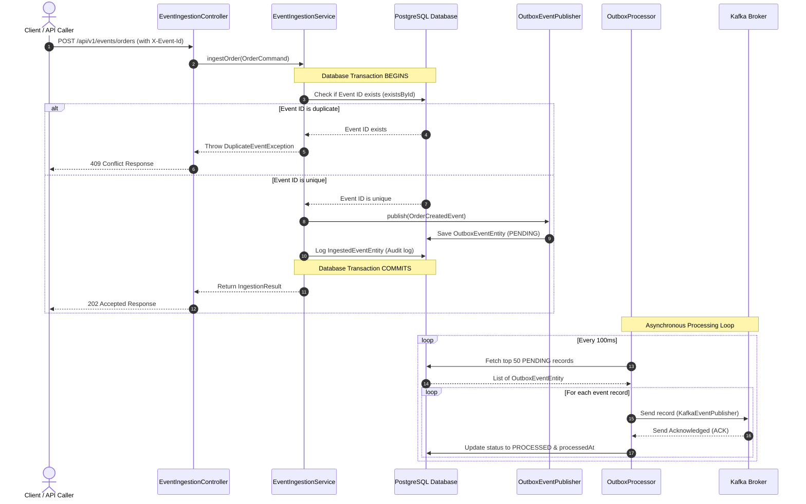
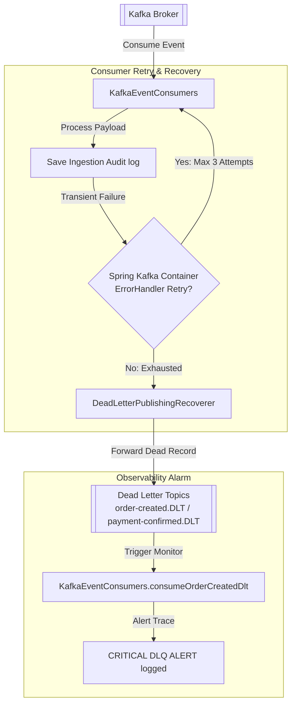

# PulseStream System Architecture Diagrams

This document contains high-fidelity **Mermaid** sequence and component diagrams visualizing the distributed systems architecture of PulseStream.

---

## 1. Container & C4 Component Diagram

```mermaid
graph TD
    Client[REST API Client / JMeter / k6] -->|HTTPS POST| IngestionGW[Event Ingestion Gateway<br/>EventIngestionController]
    Client -->|HTTPS GET| AnalyticsEngine[Analytics & Metrics Engine<br/>AnalyticsController]
    
    subgraph Spring Boot 3 Core Service [PulseStream Application]
        IngestionGW -->|Orchestrates Command| IngestionUseCase[IngestEventUseCase<br/>EventIngestionService]
        IngestionUseCase -->|Transactional Save| IngestedEventRepo[IngestedEventRepository]
        IngestionUseCase -->|Transactional Save| OutboxPublisher[EventPublisher<br/>OutboxEventPublisher]
        
        OutboxScheduler[OutboxProcessor<br/>@Scheduled Background Poll] -->|Fetch PENDING| OutboxRepo[SpringDataOutboxRepository]
        OutboxScheduler -->|Publish Event| KafkaPublisher[KafkaEventPublisher]
        
        AnalyticsEngine -->|Query Metrics| MetricsUseCase[MetricsQueryUseCase<br/>AnalyticsService]
        MetricsUseCase -->|Optimized Fetch| AnalyticsRepo[AnalyticsQueryRepository<br/>AnalyticsQueryPersistenceAdapter]
    end

    subgraph Relational Database [PostgreSQL 16]
        IngestedEventRepo -->|Deduplicate & Log| IngestedEventsTable[(ingested_events)]
        OutboxPublisher -->|Save Outbox Event| OutboxEventsTable[(outbox_events)]
        OutboxRepo -->|Read/Update Status| OutboxEventsTable
        AnalyticsRepo -->|Query Aggregates| OrdersTable[(orders)]
        AnalyticsRepo -->|Query Aggregates| PaymentsTable[(payments)]
        AnalyticsRepo -->|Query Aggregates| RefundsTable[(refunds)]
    end

    subgraph Event Broker [Kafka Broker]
        KafkaPublisher -->|At-Least-Once Send| KafkaTopics[[Kafka Event Topics<br/>order-created / payment-confirmed]]
    end
```

---

## 2. Transactional Outbox Sequence



---

## 3. Resilience, Retry, and DLQ Flow


